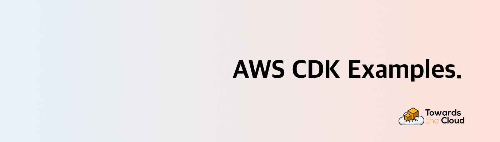

# [](https://towardsthecloud.com)

# AWS CDK Examples

A collection of AWS CDK code samples crafted in TypeScript, featured on my blog at https://towardsthecloud.com/blog

> [!TIP]
> Struggling with AWS complexity or stuck on-premise? Let's transform your cloud journey.
>
> [Schedule a call with me](https://towardsthecloud.com/contact) to find out how I can enhance your existing AWS setup or guide your journey from on-premise to the Cloud.
>
> <details><summary>☁️ <strong>Discover more about my one-person business: Towards the Cloud</strong></summary>
>
> <br/>
>
> Hi, I'm Danny – AWS expert and founder of [Towards the Cloud](https://towardsthecloud.com). With over a decade of hands-on experience, I specialized myself in deploying well-architected, highly scalable and cost-effective AWS Solutions using Infrastructure as Code (IaC).
>
> #### When you work with me, you're getting a package deal of expertise and personalized service:
>
> - **AWS CDK Proficiency**: I bring deep AWS CDK knowledge to the table, ensuring your infrastructure is not just maintainable and scalable, but also fully automated.
> - **AWS Certified**: [Equipped with 7 AWS Certifications](https://www.credly.com/users/dannysteenman/badges), including DevOps Engineer & Solutions Architect Professional, to ensure best practices across diverse cloud scenarios.
> - **Direct Access**: You work with me, not a team of managers. Expect quick decisions and high-quality work.
> - **Tailored Solutions**: Understanding that no two businesses are alike, I Custom-fit cloud infrastructure for your unique needs.
> - **Cost-Effective**: I'll optimize your AWS spending without cutting corners on performance or security.
> - **Seamless CI/CD**: I'll set up smooth CI/CD processes using GitHub Actions, making changes a breeze through Pull Requests.
>
> *My mission is simple: I'll free you from infrastructure headaches so you can focus on what truly matters – your core business.*
>
> Ready to unlock the full potential of AWS Cloud?
>
> <a href="https://towardsthecloud.com/contact"></a>
> </details>

## How to run the code from the examples

To run a Typescript example, execute the following:

```
$ npm install -g aws-cdk
$ cd EXAMPLE_DIRECTORY
$ npm install
$ cdk synth
$ cdk deploy
```

Then, to dispose of the stack/s afterwards

```
$ cdk destroy
```

## Table of Contents

| AWS CDK Example                                                                                    | Description                                                           | Blogpost link                                                                                            |
| -------------------------------------------------------------------------------------------------- | --------------------------------------------------------------------- | -------------------------------------------------------------------------------------------------------- |
| [application-load-balanced-fargate-service](./application-load-balanced-fargate-service/README.md) | Create an Application Load Balanced Fargate Service in AWS CDK        | [Click here](https://towardsthecloud.com/aws-cdk-application-load-balanced-fargate-service)              |
| [cloudfront-s3-origin](./cloudfront-s3-origin/README.md)                                           | Create a CloudFront distribution with an S3 bucket as origin          | .                                                                                                        |
| [custom-role-lambda-function](./custom-role-lambda-function/README.md)                             | Create a custom IAM role for an AWS Lambda function                   | [Click here](https://towardsthecloud.com/aws-cdk-custom-role-lambda-function)                            |
| [aws-cdk-dependson-relation](./custom-role-lambda-function/README.md)                              | Create a DependsOn relation between resources in AWS CDK              | [Click here](https://towardsthecloud.com/aws-cdk-dependson-relation)                                     |
| [openid-connect-bitbucket](./openid-connect-bitbucket/README.md)                                   | Create a Bitbucket OpenID Connect (OIDC) provider in AWS CDK          | [Click here](https://towardsthecloud.com/aws-cdk-openid-connect-bitbucket)                               |
| [openid-connect-github](./openid-connect-github/README.md)                                         | Create a GitHub OpenID Connect (OIDC) provider in AWS CDK             | [Click here](https://towardsthecloud.com/aws-cdk-openid-connect-github)                                  |
| [rds-with-cloudwatch-alarms](./rds-with-cloudwatch-alarms/README.md)                               | Create an Amazon RDS instance with custom CloudWatch alarms           | .                                                                                                        |
| [scheduled-fargate-task](./scheduled-fargate-task/README.md)                                       | Create a Scheduled Fargate Task example in AWS CDK                    | [Click here](https://towardsthecloud.com/aws-cdk-scheduled-fargate-task)                                 |
| [scheduled-rds-stop-and-start](./scheduled-rds-stop-and-start/README.md)                           | Create a Scheduled stop and start function for an Amazon RDS Instance | [Click here](https://aws.amazon.com/blogs/database/schedule-amazon-rds-stop-and-start-using-aws-lambda/) |
| [share-resources-across-stacks](./share-resources-across-stacks/README.md)                         | Create a stack where you share resources to another stack             | [Click here](https://towardsthecloud.com/share-resources-across-stacks-aws-cdk)                          |

---

## Author

[Danny Steenman](https://towardsthecloud.com/about)

[](https://www.linkedin.com/in/dannysteenman)
[](https://twitter.com/dannysteenman)
[](https://github.com/dannysteenman)
