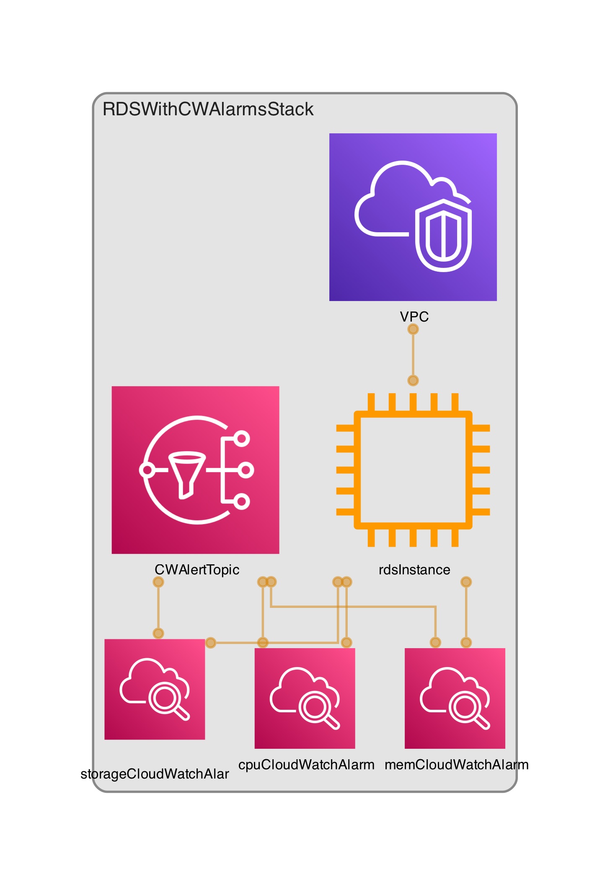

# Amazon RDS with CloudWatch alarms example in AWS CDK
---


> **This is a stable example. It should successfully build out of the box**

---



## How to use this example

### 1. Clone [this repository](https://github.com/dannysteenman/aws-cdk-examples)

```bash
git clone git@github.com:dannysteenman/aws-cdk-examples.git
```

### 2. Change to this example directory

```bash
cd aws-cdk-examples/rds-with-cloudwatch-alarms
```

### 3. Install the dependencies

```bash
npm install
```

### 4. Synthesize the stacks

To see the Cloudformation template generated by the CDK, run `cdk synth`, then check the output file in the "cdk.out" directory.

```bash
cdk synth
```

### 5. Deploy the stacks

Deploy the stack:

```bash
cdk deploy
```

### 6. Login to the AWS Console

Go to CloudFormaton in the console to see the stacks you've deployed in your default region.

### 7. Cleanup

Delete the stack:

```bash
cdk destroy
```

---

## Need help with your AWS CDK project? Hire us!

> [!TIP]
> If you're looking for expertise to elevate your cloud infrastructure, then don't hesitate to get in [touch with me](https://towardsthecloud.com/contact)!
>
> <details><summary>📚 <strong>Discover more about us</strong></summary>
>
> <br/>
>
> Towards the Cloud is a one-person agency with over 9 years of extensive hands-on experience in architecting and building highly scalable distributed systems on AWS Cloud using Infrastructure as Code for startups and enterprises.
>
> *Maximize your development speed by harnessing our expertise in crafting high-performance Cloud infrastructures.*
>
> #### Why Choose Towards the Cloud?
>
> - **Expertise in AWS CDK**: Leverage the full power of AWS Cloud Development Kit (AWS CDK) with our deep expertise. We architect and build infrastructure as code (IaC) solutions that are maintainable, scalable, and fully automated.
> - **Tailored Solutions**: Your business is unique, and so are your cloud needs. We provide personalized consultations and solutions tailored to perfectly align with your project requirements and business goals.
> - **Cost-Effective and Efficient**: Benefit from our streamlined processes and deep AWS knowledge to optimize costs without compromising on performance or security.
> - **One-on-One Attention**: As a one-person agency, Towards the Cloud guarantees you receive dedicated support and expertise directly from an AWS Cloud Engineer. This ensures high-quality deliverables and swift decision-making.<br/>
> - **Seamless CI/CD**: Empower your team to manage infrastructure changes confidently and efficiently through Pull Requests, leveraging the full power of GitHub Actions.
>
> <a href="https://towardsthecloud.com/contact"></a>
> </details>

## Author

**[Danny Steenman](https://github.com/dannysteenman)**

<p align="left">
  <a href="https://twitter.com/dannysteenman"></a>
</p>
